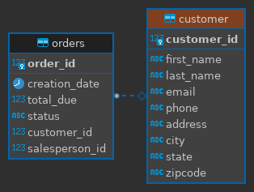
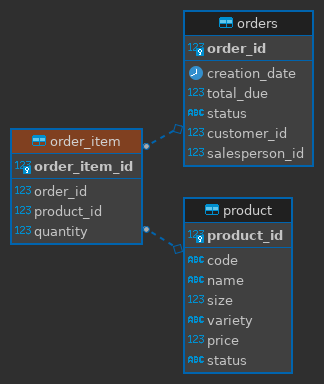
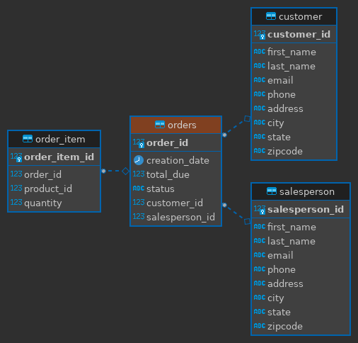
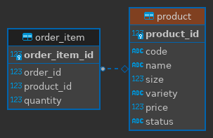
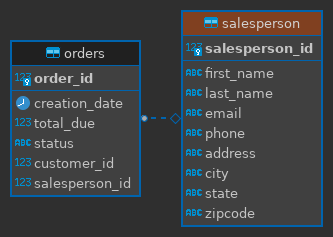

# Introduction

The JDBC project provides a framework for interacting with a PSQL database using Data Access Objects (DAO's).
The project follows the implementation provided by Frank P. Moley III in his Learning JDBC LinkedIn Learning course (https://www.linkedin.com/learning/learning-jdbc?u=107506978).
The PSQL database used in this project is populated using data from the LinkedIn Learning course's exercise files.
The project employs two DAO's. An executor class performs various operations on the database using the DAO's.
The project is written in Java using IntelliJ.
Maven cleans and packages the project.
Docker provides a container in which to store the database.

# Implementation
## ER Diagrams

DBeaver generated the following ER Diagrams.
The ER diagrams display the relationships between the tables. They also list the field names and data types in each table.

###Customer ER Diagram

###Order Item ER Diagram

###Orders ER Diagram

###Product ER Diagram

###Salesperson ER Diagram

## Design Patterns

The application uses the DAO (Data Access Object) pattern, which abstracts the JDBC code from the code performing CRUD operations on the database.
Using DAO objects, CRUD operations are performed on the database using only a single function call with no more than two arguments.
This application implements two DAO objects, namely `CustomerDAO` and `OrderDAO`.
Both DAO's extend an abstract parent class, `DataAccessObject`.

An alternative to the DAO pattern is the repository pattern.
While the DAO pattern can access multiple tables per class, the repository pattern is limited to just one table per class.
Also, when performing join operations, the repository pattern performs the join in the code rather than directly in the database.
The repository pattern also allows database sharding, which is especially advantageous when performing complex joins since users may access specific shards of the database without the need for vertical scaling.
The repository pattern is a better option than the DAO pattern if the application is database constrained, not vertically scalable, or if the data is not normalized.
Otherwise, the DAO pattern is the better option.

# Test

The `main` method in the `JDBCExecutor` class performs and simultaneously tests operations on the database.
DAO objects were created and used to perform operations on the database in the `main` method.
The operations performed and tested include querying existing data, adding new data, modifying existing data, and deleting existing data.
A query confirming the successful completion of an operation follows all operations, with the lone exception of a delete operation.
Successful tests resulted in no build errors and query results that matched either the results shown in the LinkedIn Learning videos or the expected results, given changes to the implementation.

# References

[1] Baeldung. (2021) _The DAO Pattern in Java_. Baeldung. https://www.baeldung.com/java-dao-pattern

[2] Moley III, Frank P. (2021) _Learning JDBC_. Lynda. https://www.linkedin.com/learning/learning-jdbc?u=107506978