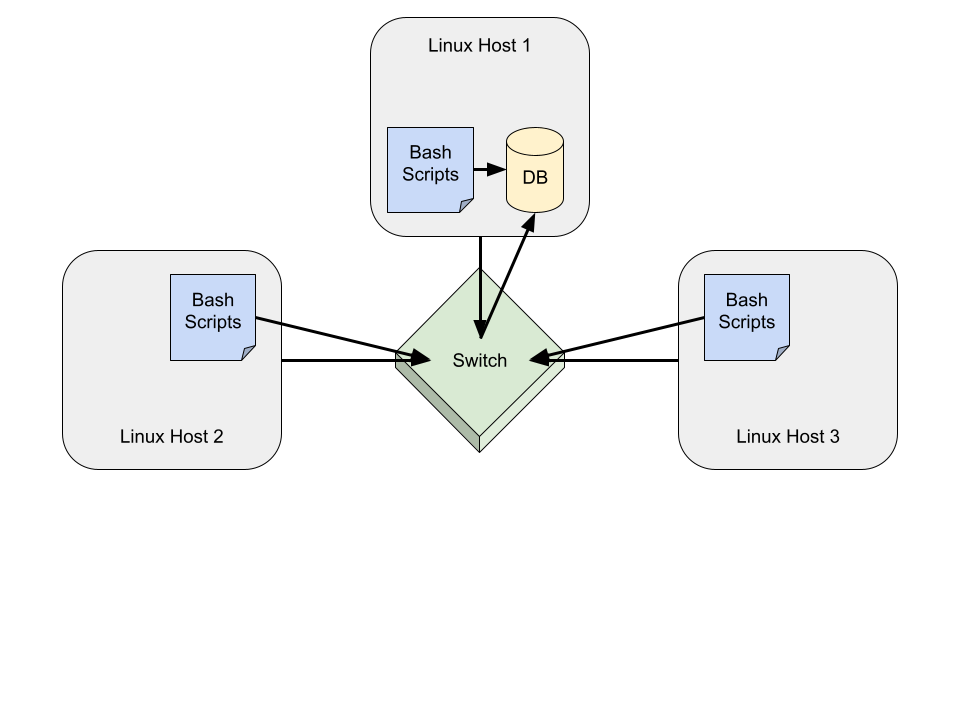

# Linux Cluster Monitoring Agent

# Introduction

The project objective is to develop a system that collects hardware information and resource usage data
from all Linux hosts connected on a local network, then store the data in a postgreSQL database for analysis.
This process takes place within a container created and managed by Docker.
Within this container, a PSQL instance is created and used to store the collected data in two distinct tables: `host_info` and `host_usage`.
Five different scripts are used to complete the project.
The scripts are used to start Docker, set up PSQL tables, collect hardware information and usage data from all connected Linux hosts,
    and query data from the PSQL tables.
Crontab is used to automate the process of collecting usage data from the host device by running the appropriate script 
    every minute while the system is active.
The queried data is then used to address various questions related to the hardware information and usage data from all connected hosts.

# Quick Start

The following sequence of commands can be used to quickly access and execute each stage of the project.

```Bash
# 1. Start Docker
./psql_docker.sh start

# 2. Setup tables
./ddl.sql

# 3. Run host_info script
./host_info.sh [host] [port] [database_name] [user] [password]

# 4. Setup crontab to automate host_usage script
crontab -e
* * * * * bash /./host_usage.sh [host] [port] [database_name] [user] [password] &> /tmp/host_usage.log

# 5. Run queries script to retrieve usage data
./queries.sql
```

# Implementation

**1. Setup**

The first step in the implementation process was to set up GitHub and Docker.
This included setting up a GitHub repo with a series of branches to later be used throughout the development of this project, as well as future projects.
This step also involved installing Docker, creating a container, and setting up a PSQL database within the container.
A script would eventually be written to simplify the process of starting the container.

**2. Create PSQL tables**

Steps 2 and 3 in the implementation were completed simultaneously.
In this stage, two PSQL tables are created using a SQL script (if they weren't already created using the command line).
A list of all fields in each table can be found below.

The `host_info` table contains various hardware specifications, including the following:
* `id` The number of the record in the table. This field also serves as the primary key
* `hostname` The name of the host device
* `cpu_number` The number of CPU's
* `cpu_architecture` The framework of the host device
* `cpu_model` The model name of the host device
* `cpu_mhz` CPU main frequency
* `l2_cache` Memory in second level cache in kb
* `total_mem` The total memory of the host device
* `timestamp` The current date and time

The `host_usage` table contains various usage statistics, including the following:
* `host_id` A reference to the corresponding `id` value from the `host_info` table
* `memory_free` Free memory in mb
* `cpu_idle` Percent of time CPU is idle
* `cpu_kernel` Percent of time CPU is running kernel code
* `disk_io` Number of disk I/O
* `disk_available` Available disk in mb
* `timestamp_` The current date and time

**3. Collect Hardware Information and Usage Data**

In this step, certain data points needed to be collected from the host device.
This was accomplished using various command line functions in Bash.
These command line functions display various data points related to hardware specifications, memory usage, CPU and disk usage, etc., and were trimmed
to display only certain data points. Using scripts, these pieces of data were then saved to variables and inserted into the PSQL database.

**4. Automate the Collection of Usage Data**

The next step in the process was to automate the collection of usage data from the host using Crontab.
Crontab was set up to automatically run the script that collects usage data and inserts it into the PSQL database.
Crontab runs this script once every minute that the system is active.

**5. Query To Address Questions**

The final step in the process was to use the collected usage data to address certain questions. The questions to be addressed are listed below:
1. Group hosts by hardware info
2. Average memory usage (as a percentage) displayed over 5-minute intervals
3. Detect host failure

To address these questions, the usage data in the PSQL database is queried to display the data needed to answer each question.
The SQL code used to query data to address each question is stored in the `queries.sql` script.

## Architecture

The architecture of the project is depicted in the diagram below.
Please note that the scope of this project does not include using a switch to connect with other Linux hosts, as is shown in the diagram.
Only one host device was used for the implementation of the project.
The diagram depicts how the architecture would be set up if multiple hosts were connected through a switch.

As shown in the diagram, the host device uses bash and SQL scripts to access, insert, and query data from the database.
All hosts running the appropriate scripts will collect their hardware and usage data and send it to the database on Linux host 1.
Although data is gathered into the database from all connected hosts, only Linux host 1 is able to query data from the database.



## Scripts

The project uses 5 different scripts. Please find descriptions of each script below.

**`psql_docker.sh`**

The `psql_docker.sh` script can be used to start, stop, or create a Docker container.
Although in this project, only the start command is used.
```Bash
# Start docker if not already started
# Check command, accept only start, stop, and create commands
# Start, stop, or create depending on command
```

**`ddl.sql`**

The `ddl.sql` script creates two tables within the PSQL database.
The first table, `host_info`, will be used to store the host's hardware information.
The second table, `host_usage`, will be used to store the host's usage data (memory, CPU, disk).
```Bash
# Create host_info table if not already created
# Create host_usage table if not already created
```

**`host_info.sh`**

The `host_info.sh` script takes in 5 arguments (host, port, database name, user, password) 
and uses them to insert the host device's hardware information into the `host_info` table.
```Bash
# Save arguments to variables
# Check to make sure the expected number of arguments is entered
# Create variables to store commands for hardware specifications
# Create variables to store individual hardware specifications
# Save password as an environment variable
# Insert data into the host_info table
```

**`host_usage.sh`**

The `host_usage.sh` script takes in 5 arguments (host, port, database name, user, password)
and uses them to insert the host device's usage data into the `host_usage` table.
Using Crontab, this script is automated to run every minute.
```Bash
# Save arguments to variables
# Check to make sure the expected number of arguments is entered
# Create variables to store commands for usage data
# Create a hostname variable to compare with host_info to find the matching id
# Create variables to store individual usage data statistics
# Save password as an environment variable
# Insert data into the host_usage table
```

**`queries.sql`**

The `queries.sql` script is used to address three questions regarding the hardware information and usage data of the host devices.
```Bash
# Group hosts by hardware info
# Find average memory usage
# Detect host failure
```

## Database Modelling

The project uses two tables within the PSQL database.
The first table stores the hardware specifications of the host device.
The second table stores various usage statistics of the host device.
The schema for each table can be found below (filled with sample data).

`host_info` schema

 id | hostname | cpu_number | cpu_architecture | cpu_model | cpu_mhz | l2_cache | total_mem | timestamp |
--- | -------- | ---------- | ---------------- | --------- | ------- | -------- | --------- | --------- |
 1 | jrvs-remote-desktop | 2 | x86_64 | Intel(R) | 2200 | 256 | 8000000 | 2021-10-18 13:57:20 |

`host_usage` schema

 host_id | memory_free | cpu_idle | cpu_kernel | disk_io | disk_available | timestamp |
-------- | ----------- | -------- | ---------- | ------- | -------------- | --------- |
 1 | 3000 | 95 | 0 | 0 | 24000 | 2021-10-18 13:57:20 |

# Test

All scripts and queries were tested through trial and error.

Following the completion of the `psql_docker.sh` script, the script was run successfully.
The script successfully starts and stops containers.
However, the "create container" functionality of the script has not yet been tested due to the lack of need to create any additional containers.

Some code from the `host_info.sh` and `host_usage.sh` scripts was tested prior to the creation of the scripts.
These tests were performed on the command line in the Linux terminal to verify trimmed variable strings contained only the desired information.
Additional code was later added to the scripts to add required arguments (host, port, database name, user, password).
The completed scripts were then tested using trial and error. The scripts are designed to insert data into tables in a PSQL database, 
    so to confirm the scripts were working as intended, the tables were queried using the Linux command line to confirm the new records were inserted as expected.

Early versions of both the `host_info.sh` and `host_usage.sh` scripts ran the `ddl.sql` script.
Given that the scripts produced the expected result, it was assumed that the `ddl.sql` script was functioning as expected.
The use of the script was later removed from both shell scripts when it was discovered that it was not necessary to include.
By this time, both tables created in the `ddl.sql` script had been created and were working as expected, leaving no further need to use the script or test it extensively.

SQL queries in the `queries.sql` script were tested by copy and pasting certain code blocks into the Linux command line (after accessing the PSQL database).
Trial and error was used until the expected result was achieved.

# Deployment

The application was deployed using GitHub, Docker, and Crontab.
GitHub was used for version control.
Most GitHub actions were conducted using bash directly in the Linux CLI terminal (pushing, pulling, adding/deleting/modifying branches).
Some GitHub actions took place through the remote repository on github.com, namely pull requests and some branch management.
Docker was used to create and manage a container in which the application is built.
Crontab was also used to automate the `host_usage` script, which collects usage data from the host device every minute.

# Improvements

In the event that this project is revisited, there are a few improvements to consider.

1. Consider additional questions and add queries to the `queries.sql` script accordingly.
2. Perform more extensive testing on all scripts.
3. Output query data in a format that is easier to read/use (writing to a text file, rather than the command line).