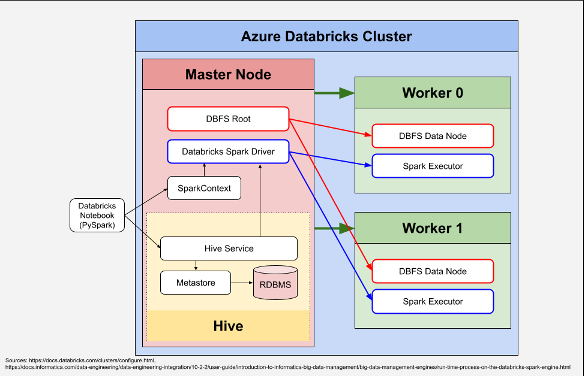
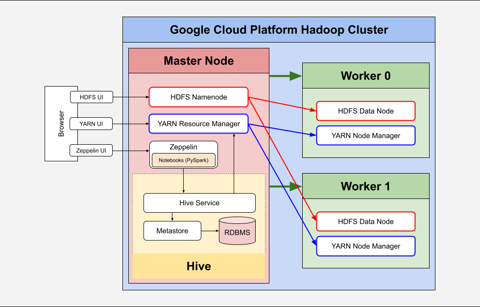

Table of Contents
* [Introduction](#Introduction)
* [Databricks and Hadoop Implementation](#Databricks-and-Hadoop-Implementation)
* [Zeppelin and Hadoop Implementation](#Zeppelin-and-Hadoop-Implementation)
* [Future Improvement](#Future-Improvement)

# Introduction

The Spark project is a big data analytics project that uses Hadoop and Spark clusters, 
    along with Zeppelin and Azure Databricks notebooks to address various business problems relating to a pair of datasets.
Both clusters include a master node and a pair of worker nodes.
The Zeppelin notebook running on the Hadoop cluster addresses business questions relating to a dataset of various indicators for every country from 1960 to 2016.
The Databricks notebook running on the Spark cluster addresses business questions relating to a dataset of invoices from a business.
Both notebooks used mainly PySpark, with some SQL code as well.
The testing process involved trial and error tests for each cell in both notebooks.
The project was deployed using both Google Cloud Platform and Azure Databricks, which were used to provision the clusters.

# Databricks and Hadoop Implementation
## Dataset

The dataset analyzed in the Databricks notebook contains business invoices and contains 824,364 rows of data.
The schema is displayed below:

| Field Name  | Data Type   |
|:------------|-------------|
| Invoice     | string      |
| StockCode   | string      |
 | Description | string      |
 | Quantity    | integer     |
 | InvoiceDate | timestamp   |
 | Price       | double      |
 | CustomerID  | double      |
 | Country     | string      |

## Analytics

The notebook can be found at the following link: [Retail Data Analytics with PySpark.ipynb](https://github.com/jarviscanada/jarvis_data_eng_JoshWessel/blob/master/spark/notebook/Retail%20Data%20Analytics%20with%20PySpark.ipynb)
The notebook addresses the following business problems:
- Calculate the number of invoices
- Find the number of placed and cancelled orders by month
- Calculate the monthly total sales
- Calculate the monthly sales growth as a percentage
- Find the number of active users for each month
- Find the number of new and existing users for each month
- Perform RFM segmentation

## Architecture

The architecture of the databricks cluster includes a master node and a pair of worker nodes.
The master node contains the Hive metastore, the SparkContext, the spark driver and the DBFS root.
The worker nodes each contain a Spark executor and a DBFS data node which is used to store the data.
The notebook is attached to the cluster, and interacts with the driver through the SparkContext and the Hive service.
The driver then distributes jobs to the executors in the worker nodes.

# Zeppelin and Hadoop Implementation
## Dataset

The dataset analyzed in the Zeppelin notebook contains various indicators (most notably GDP) for every country from 1960 to 2016.
The dataset contains 21,759,413 rows of data.
The schema is displayed below:

| Field Name     | Data Type |
|----------------|-----------|
| year           | integer   |
| countryname    | string    |
| countrycode    | string    |
| indicatorname  | string    |
| indicatorcode  | string    |
| indicatorvalue | string    |

## Analytics

The notebook can be found at the following link: [Spark Dataframe - WDI Data Analytics](https://github.com/jarviscanada/jarvis_data_eng_JoshWessel/blob/master/spark/notebook/Spark%20Dataframe%20-%20WDI%20Data%20Analytics.ipynb)
The notebook addresses the following business problems:
- Show historical GDP data for Canada
- Show GDP for each country and sort by year
- Find the highest GDP for each country

## Architecture

The architecture of the Hadoop cluster used to run the Zeppelin notebook includes a master node and a pair of worker nodes.
The master node contains the Hive metastore, the YARN resource manager, the HDFS name node, and a Zeppelin component used to run the Zeppelin notebook.
The worker nodes each contains an HDFS data node and a YARN node manager.
The notebook is accessed through the Zeppelin UI and interacts with the YARN resource manager through the Hive service.

# Future Improvement
Below are a few improvements to consider:
1. Add more detailed introduction and conclusion cells to both notebooks
2. Reformat the code in the notebooks to follow a consistent format
3. Add visualizations to the Databricks notebook